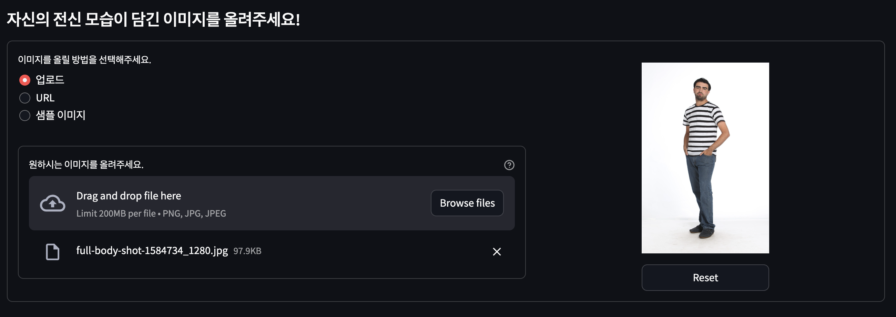
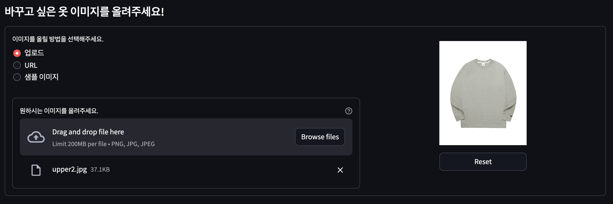
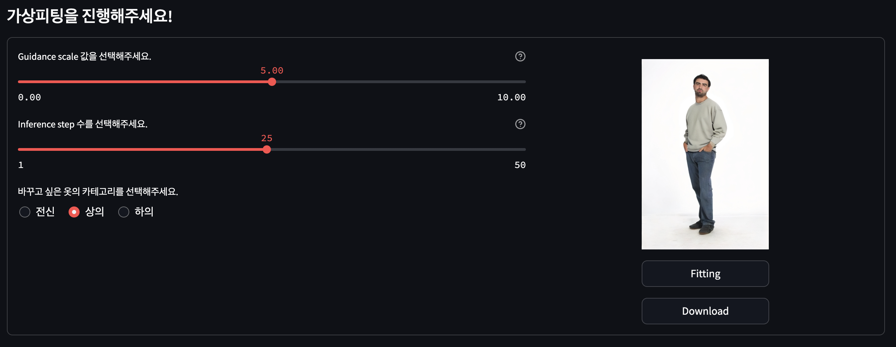
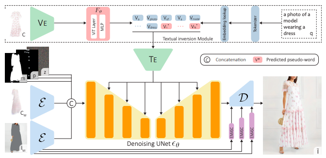
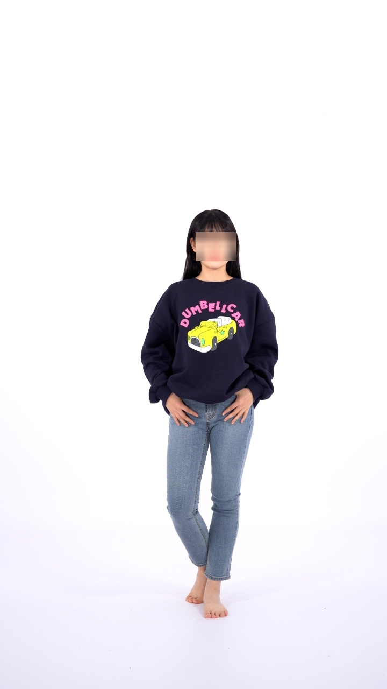
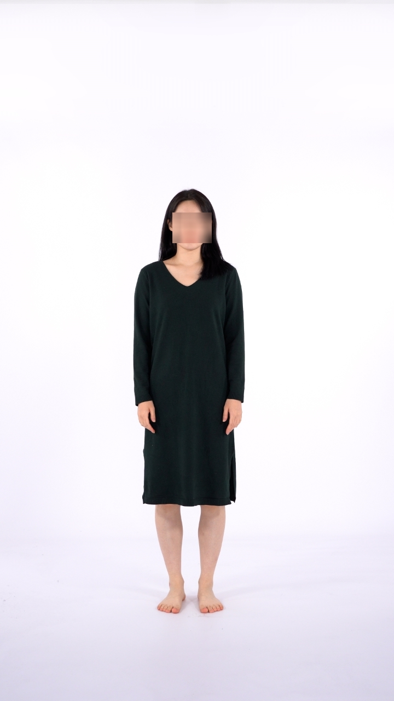
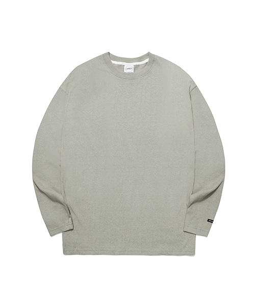
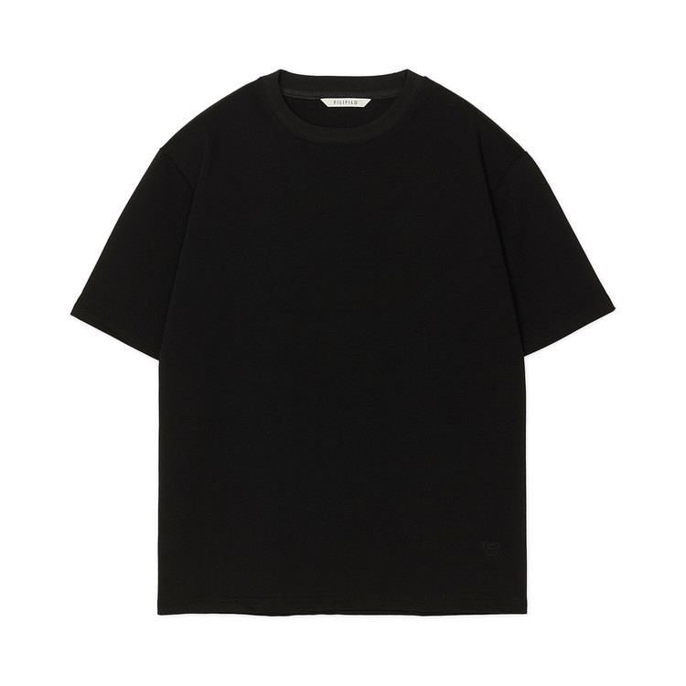
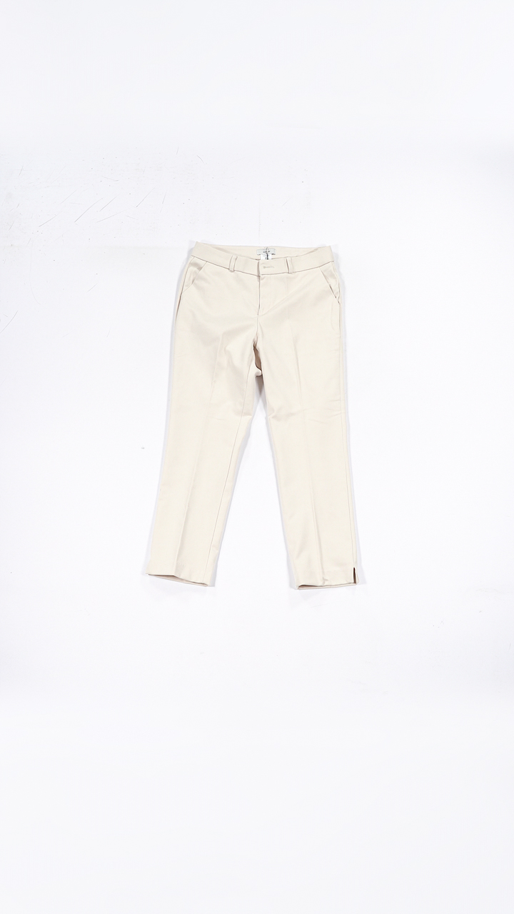

# Introduce
  

# Quick Start

- Colab ver : [demo.ipynb](https://colab.research.google.com/drive/1d8Gru4StkeEqDCKkezqBWk-1LR1SqKwa?usp=sharing)

- Colab+Web ver : [demo_web.ipynb](https://colab.research.google.com/drive/1x_ekYurjD4MFr4r0KIX_RDQxc1cunx5U?usp=sharing)
 

# How to Use

### 1. `업로드/URL` 을 통해 본인 사진을 선택하거나 `샘플 이미지` 선택하기 
 

  

### 2. 피팅하고 싶은 옷 이미지 선택하기
 

  

### 3. 가상피팅 진행하기
 

  

# Requirements
~~~txt
!pip install -q accelerate==0.26.1
!pip install -q diffusers==0.14.0
!pip install -q transformers==4.27.3
!pip install -q ftfy==6.1.3
!pip install -q clean-fid==0.1.35
!pip install -q torchmetrics==1.3.0.post0
!pip install -q opencv-contrib-python==4.8.0.76
!pip install -q openmim==0.3.8
!mim install -q mmcv==2.1.0
!mim install -q mmengine==0.10.3
!mim install -q mmpose==1.3.1
!pip install -q xtcocotools==1.14.3
!pip install -q munkres==1.1.4
~~~

 

# Model Usage

[***Ladi Vton***]([https://github.com/Stability-AI/stablediffusion](https://github.com/miccunifi/ladi-vton))  

 

 

# Sample Images

  
  

 
  

 
  

 

# Contributions
|     Name      |                   Kim DoHyeon                    |              Park JiWan              |          Choi Hwan          |          Kwon YongWoo         |         Hwang  HoSik         |         Choi TaeEun         |         Jin YuJin         |         
| :-----------: | :----------------------------------------------: | :----------------------------------: | :----------------------------------------: | :-------------------------------------: | :----------------------------------: | :----------------------------------: | :----------------------------------: |  
| **Github ID** | [@Dohyeon-Kim1](https://github.com/Dohyeon-Kim1) | [@jiwaan](https://github.com/jiwaan) | [@whan789](https://github.com/whan789) | [@Kwonyongwoo](https://github.com/Kwonyongwoo) | [@audtia22](https://github.com/audtla22) | [@tiachoi2001](https://github.com/tiachoi2001) | [@eugenebori](https://github.com/eugenebori) |

